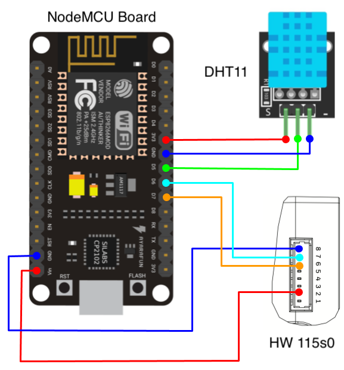
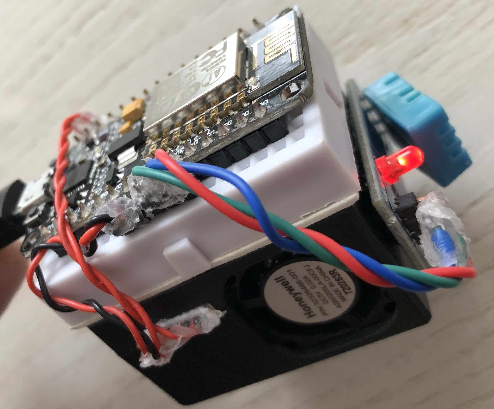

# ESP8266 CanAirIO Sensor

## What is this?
This is a much shorter version of the Particulate Matter Monitor for the [CanAirIO Project](https://canair.io), a citizen science project using mobile and static sensors to measure air quality with cell phones and low-cost technology. 

## My Build

My version removes a lot of parts that are not really needed for static sensors, and so I only use 3 components:

### Parts list
- NodeMCU v1.1 board (or similar ESP8266)
- DHT11 temperature and humidity sensor
- Honeywell 115s0 PM sensor

### Circuit Diagram
The diagram is very simple:

### Build Result
For this version, I just glued everything to the case of the PM sensor, making sure that I don't block the air flow and put it in the balcony:

I still need to put this in a case that can handle rain, but that will be a project for next weekend!

### Build Note
I am powering the board via USB, and using the `Vin` pin as `Vout` to power the sensor. This works well but there is a diode that causes problems so it needs to be shorted, else the voltage drops and the PM sensor reads higher than real values. 

## The Code

There are 2 .ino files, `esp-canairio.ino` and `esp-canairio-nolib.ino` (the one I am currently using). Both are basically the same but the `esp-canairio-nolib.ino` manually sends commands to the 115s0 sensor instead of using a library (I was having checksum problems).

### Libraries used
- [hpma115s0 from Felixgalindo](https://github.com/felixgalindo/HPMA115S0) (only in `esp-canairio.ino`)
- [DHTesp](https://github.com/beegee-tokyo/DHTesp)
- [CanAirIoApi](https://github.com/kike-canaries/esp32-hpma115s0/blob/master/lib/canairioapi/src/)
- ESP8266WiFi
- SoftwareSerial

### Configurations
The `MyConfigs.cpp` file has all the variables needed for Wifi and the CanAirIO Api. Use your own here and upload to the board using the Arduino IDE and you are good to go!

### Code Note
C++ is not my main language, so my code might need some improvement. I am open for comments!
